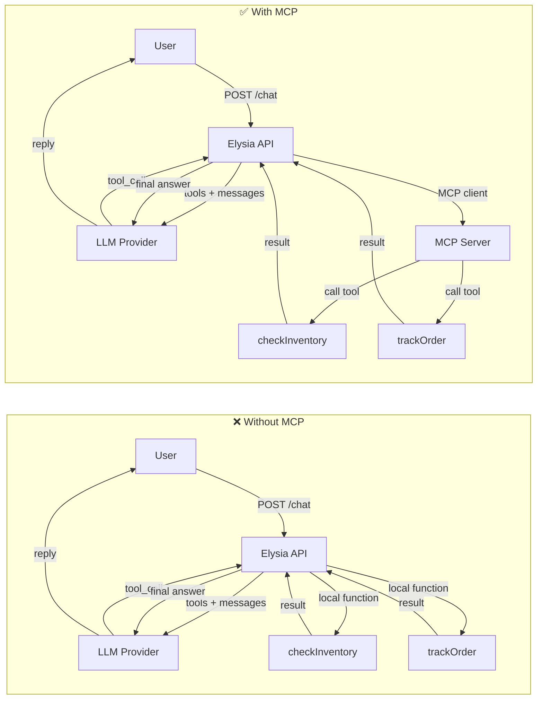

# 01 - Simple MCP (Model Context Protocol)

A minimal demo showing how to add **tool calling** to an LLM — with and without MCP — using two providers: **Azure OpenAI** and **Ollama**.

## Tech Stack

| Tool | Purpose |
|---|---|
| **TypeScript** | Language |
| **Bun** | Runtime & package manager |
| **Elysia** | API server framework |
| **OpenAI SDK** | Azure OpenAI client (aoai samples) |
| **MCP SDK** | Model Context Protocol server & client (with-mcp samples) |
| **Ollama** | Local LLM provider (ollama samples) |

## How It Works

There are **4 sample files** — a 2×2 matrix of provider × MCP usage:

| | **Without MCP** | **With MCP** |
|---|---|---|
| **Azure OpenAI** | `api-without-mcp-aoai.ts` | `api-with-mcp-aoai.ts` |
| **Ollama** | `api-without-mcp-ollama.ts` | `api-with-mcp-ollama.ts` |

**Without MCP** — tools are defined inline as JSON and dispatched via a local function registry.
**With MCP** — tools are registered on an in-process MCP server; the API discovers and calls them through the MCP client protocol.



## Project Structure

```
01-simple-mcp/
├── README.md
├── index.html                           # Chat UI (served by Vite, uses /api/chat)
├── package.json                         # Vite dev server (proxy /api → port 9000)
├── vite.config.ts                       # Vite proxy configuration
└── api/
    ├── package.json
    ├── data/
    │   ├── inventory.ts                 # Mock inventory data (5 products × 2 branches)
    │   └── orders.ts                    # Mock order data (6 orders with tracking)
    └── sample-mcp/
        ├── aoai/                        # Azure OpenAI samples (uses OpenAI SDK)
        │   ├── .env                     # Your Azure OpenAI credentials
        │   ├── .env.example
        │   ├── api-without-mcp-aoai.ts  # Tool calling without MCP
        │   └── api-with-mcp-aoai.ts     # Tool calling with MCP
        └── ollama/                      # Ollama samples (local LLM)
            ├── .env.example
            ├── api-without-mcp-ollama.ts
            └── api-with-mcp-ollama.ts
```

## Prerequisites

- [Bun](https://bun.sh) installed
- **For Azure OpenAI samples:** An Azure OpenAI resource with a chat deployment (e.g. `gpt-4o-mini`)
- **For Ollama samples:** [Ollama](https://ollama.com) installed and running locally with a model (e.g. `llama3.1`)

## Getting Started

### 1. Install Dependencies

```bash
cd demo/01-simple-mcp
bun install            # Vite (UI dev server)
cd api && bun install  # API dependencies
```

### 2. Configure Environment (Azure OpenAI only)

```bash
cd sample-mcp/aoai
cp .env.example .env
# Edit .env with your Azure OpenAI credentials
```

### 3. Run a Sample

**Azure OpenAI — without MCP:**

```bash
cd demo/01-simple-mcp/api/sample-mcp/aoai
bun run --env-file .env api-without-mcp-aoai.ts
```

**Azure OpenAI — with MCP:**

```bash
cd demo/01-simple-mcp/api/sample-mcp/aoai
bun run --env-file .env api-with-mcp-aoai.ts
```

**Ollama — without MCP:**

```bash
cd demo/01-simple-mcp/api/sample-mcp/ollama
bun run api-without-mcp-ollama.ts
```

**Ollama — with MCP:**

```bash
cd demo/01-simple-mcp/api/sample-mcp/ollama
bun run api-with-mcp-ollama.ts
```

### 4. Start the UI (Vite dev server)

In a **separate terminal:**

```bash
cd demo/01-simple-mcp
bun run dev            # → http://localhost:5173
```

Vite proxies `/api/*` requests to the API server on port 9000, so no CORS issues.

Open http://localhost:5173 to use the chat UI.

### 5. Test

**Using curl (directly to API):**

```bash
curl -X POST http://localhost:9000/chat \
  -H "Content-Type: application/json" \
  -d '{"message": "How many units of GAD-001 are left at BKK-SILOM?"}'
```

**Using curl (via Vite proxy):**

```bash
curl -X POST http://localhost:5173/api/chat \
  -H "Content-Type: application/json" \
  -d '{"message": "What is the status of order ORD-002?"}'
```

## Available Tools

| Tool name | Description |
|---|---|
| `check_inventory` | Check product inventory by product ID and/or branch ID |
| `track_order` | Track an order by order ID or customer name |

## Environment Variables

### Azure OpenAI (`aoai/.env`)

| Variable | Required | Description |
|---|---|---|
| `AZURE_OPENAI_ENDPOINT` | ✅ | Azure OpenAI endpoint URL |
| `AZURE_OPENAI_API_KEY` | ✅ | API key |
| `AZURE_OPENAI_DEPLOYMENT` | ✅ | Deployment name (e.g. `gpt-4o-mini`) |
| `PORT` | — | Server port (default: `9000`) |

### Ollama (`ollama/.env`)

| Variable | Required | Description |
|---|---|---|
| `OLLAMA_URL` | — | Ollama URL (default: `http://localhost:11434`) |
| `OLLAMA_MODEL` | — | Model name (default: `llama3.1`) |
| `PORT` | — | Server port (default: `9000`) |
