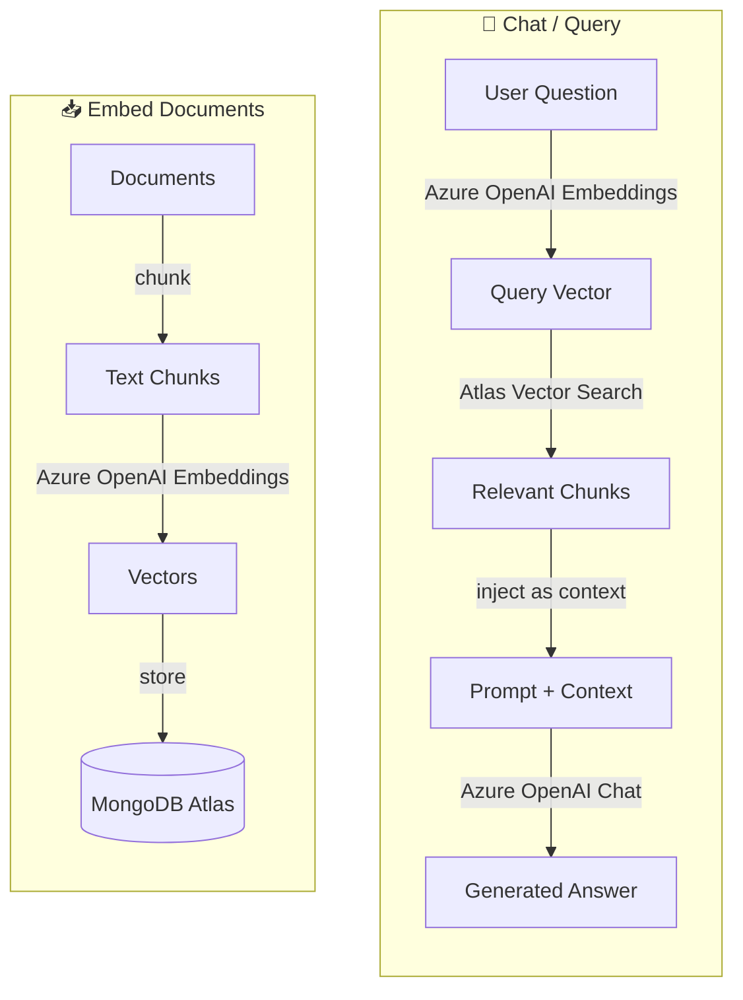

# 02 - Simple RAG (Retrieval Augmented Generation)

A minimal, single-file example demonstrating how to build a RAG pipeline using **MongoDB Atlas Vector Search** and **Azure OpenAI**.

## Tech Stack

| Tool | Purpose |
|---|---|
| **TypeScript** | Language |
| **Bun** | Runtime & package manager |
| **MongoDB Atlas** | Vector store & similarity search |
| **Azure OpenAI** | Embeddings (`text-embedding-3-small`) & Chat (`gpt-4o-mini`) via OpenAI SDK |

## How It Works



## Project Structure

```
02-simple-rag/
├── README.md        # This file
├── .env             # Your credentials (not committed)
├── .env.example     # Template for environment variables
├── data.ts          # Sample documents to embed
└── rag.ts           # Single file containing the entire RAG pipeline
```

> **`rag.ts`** is a self-contained CLI that walks through every step with rich, easy-to-follow comments:
>
> 1. **Embed** – Reads documents, generates embeddings via Azure OpenAI, and stores them in MongoDB.
> 2. **Query** – Converts a user question into a vector, performs Atlas Vector Search, and retrieves relevant chunks.
> 3. **Generate** – Sends the retrieved context + question to Azure OpenAI Chat to produce a grounded answer.

## Prerequisites

- [Bun](https://bun.sh) installed
- A **MongoDB Atlas** cluster with **Atlas Vector Search** (vector index) configured
- An **Azure OpenAI** resource with embedding and chat deployments

## Getting Started

```bash
# Install dependencies
cd demo/02-simple-rag
bun install

# Configure environment
cp .env.example .env
# Edit .env with your credentials

# Embed documents into MongoDB
bun run --env-file .env rag.ts embed

# Chat — ask a question using RAG
bun run --env-file .env rag.ts chat "What is MongoDB Atlas Search?"
```

After embedding, **create an Atlas Vector Search index**:
1. Go to **MongoDB Atlas** → your cluster → **Atlas Search** → **Create Index**
2. Database: `rag_demo`, Collection: `documents`, Index name: `vector_index`
3. Field path: `embedding`, Dimensions: `1536`, Similarity: `cosine`

## CLI Usage

```
bun run --env-file .env rag.ts <command>

Commands:
  embed               Embed documents into MongoDB Atlas
  chat <question>     Ask a question using RAG
```

## Environment Variables

| Variable | Required | Description |
|---|---|---|
| `MONGODB_URI` | ✅ | MongoDB Atlas connection string |
| `AZURE_OPENAI_ENDPOINT` | ✅ | Azure OpenAI endpoint URL |
| `AZURE_OPENAI_API_KEY` | ✅ | Azure OpenAI API key |
| `AZURE_EMBEDDING_DEPLOYMENT` | — | Embedding model deployment (default: `text-embedding-3-small`) |
| `AZURE_CHAT_DEPLOYMENT` | — | Chat model deployment (default: `gpt-4o-mini`) |
