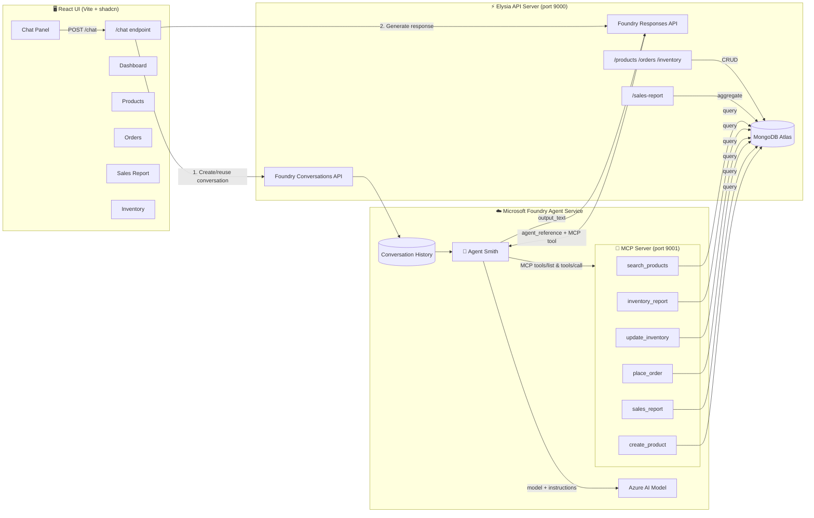

# 03 - ZStore E-Commerce Chatbot

A demo e-commerce back-office app with an AI chatbot (**Agent Smith**) that can search products, place orders, generate sales reports, and check inventory — all powered by Azure AI and tool calling.

## Tech Stack

| Tool | Purpose |
|---|---|
| **TypeScript** | Language |
| **Bun** | Runtime & package manager |
| **Microsoft Foundry Agent Service** | Agent orchestration, conversations, and responses |
| **Azure AI** | LLM provider (via Foundry-managed agents) |
| **MongoDB Atlas** | Database & Vector Search (future) |
| **Elysia** | API server framework |
| **React 19** | Frontend UI library |
| **Vite 8** | Frontend build tool |
| **shadcn/ui** | Component library (dark theme, orange accents) |

## Architecture



> **Key concept:** The agent (Agent Smith) is pre-configured in Azure Foundry with its model and instructions. The API server injects the MCP tool connection **at runtime** via the `tools` array in `responses.create()`. The Foundry agent auto-discovers tools from the MCP server and calls them as needed. All UI pages pull live data from MongoDB via REST endpoints.

## API Endpoints

| Method | Path | Description |
|--------|------|-------------|
| `GET` | `/products` | List all products from MongoDB (excludes embedding vectors) |
| `POST` | `/products` | Create a new product |
| `GET` | `/inventory` | List all inventory records |
| `PUT` | `/inventory` | Update stock for a specific product + branch |
| `GET` | `/orders` | List all orders (sorted by date desc) |
| `POST` | `/orders` | Create a new order |
| `GET` | `/sales-report` | Aggregated sales statistics (revenue, counts, by-product breakdown) |
| `POST` | `/chat` | Send a message to Agent Smith (Foundry Agent) |

## Project Structure

```
03-simple-ecommerence-chat/
├── PLAN.md                        # Original design plan
├── README.md                      # This file
├── agent-instructions.txt         # Agent Smith system prompt (loaded at startup)
├── AGENT_INSTRUCTIONS.md          # Full reference: instructions + sample use cases
├── api/
│   ├── .env                       # Environment variables (Foundry + MongoDB + Azure OpenAI)
│   ├── server.ts                  # Elysia API server using Foundry Agent Service
│   ├── mcp-server.ts              # MCP server — exposes tools for Foundry agent
│   ├── seed-db.ts                 # Helper: seed MongoDB + generate product embeddings
│   ├── data/
│   │   ├── products.ts            # Product catalog (8 gadgets)
│   │   ├── inventory.ts           # Stock levels across 3 branches
│   │   └── sales.ts               # Order history (10 orders)
│   └── tools/
│       ├── index.ts               # Tool registry (definitions + handlers)
│       ├── search-products.ts     # Search products by keyword/category
│       ├── place-order.ts         # Place a new order
│       ├── sales-report.ts        # Generate sales reports
│       └── inventory-report.ts    # Check stock levels
└── ui/
    ├── src/
    │   ├── App.tsx                # Root layout (sidebar + floating chat + taskbar)
    │   ├── main.tsx               # React entry point
    │   ├── index.css              # Tailwind + shadcn dark theme (orange accents)
    │   ├── components/
    │   │   ├── app-sidebar.tsx    # Navigation sidebar
    │   │   ├── chat-window.tsx    # Floating chat overlay
    │   │   ├── taskbar.tsx        # Fixed bottom taskbar with chat trigger
    │   │   └── ui/               # shadcn components
    │   └── pages/
    │       ├── dashboard.tsx      # Overview with live stats from MongoDB
    │       ├── products.tsx       # Product catalog + create product
    │       ├── orders.tsx         # Order history table
    │       ├── sales-report.tsx   # Revenue breakdown
    │       └── inventory.tsx      # Stock levels table
    └── vite.config.ts
```

## Prerequisites

- [Bun](https://bun.sh) installed
- A **MongoDB Atlas** cluster (free tier works)
- An **Azure subscription** with a **Microsoft Foundry project**
- An **Azure OpenAI** resource with an embedding deployment (e.g. `text-embedding-3-small`)
- Azure CLI logged in (`az login`) for `DefaultAzureCredential`

## Getting Started

### 1. Configure Environment

```bash
cd api
bun install

# Configure environment
cp .env.example .env
# Edit .env with your credentials (see .env.example for all variables)
```

### 2. Seed MongoDB with Data & Embeddings

```bash
# Seed all collections (products + embeddings, inventory, orders)
bun run seed

# Or seed individually from the api/ directory:
cd api
bun run seed-db.ts products     # Products with vector embeddings
bun run seed-db.ts inventory    # Inventory records
bun run seed-db.ts orders       # Order history
```

After seeding, **create an Atlas Vector Search index** on the `products` collection:

1. Go to **MongoDB Atlas** → your cluster → **Atlas Search** → **Create Index**
2. Choose **JSON Editor** and paste:

```json
{
  "fields": [
    {
      "type": "vector",
      "path": "embedding",
      "numDimensions": 1536,
      "similarity": "cosine"
    }
  ]
}
```

3. Set: Database = `zstore`, Collection = `products`, Index name = `vector_index`

### 3. Start the MCP Server (tools for Foundry agent)

```bash
bun run dev:mcp         # → http://localhost:9001/mcp
```

This exposes the 6 ZStore tools (`search_products`, `inventory_report`, `update_inventory`, `place_order`, `sales_report`, `create_product`) over MCP Streamable HTTP.

### 4. Expose the MCP Server to the Internet

Azure Foundry runs in the cloud and **cannot reach `localhost`**. You must expose port 9001 via a public tunnel so the Foundry agent can call your MCP tools.

**Using ngrok (recommended for demos):**

```bash
# 1. Install ngrok: https://ngrok.com/download
# 2. Start the tunnel:
ngrok http 9001

# 3. Copy the public URL (e.g. https://abc123.ngrok-free.app)
# 4. Update your .env file:
#    MCP_SERVER_URL=https://abc123.ngrok-free.app/mcp
```

**Using VS Code port forwarding:**

```
1. Open the "Ports" panel in VS Code (Ctrl+Shift+P → "Ports: Focus on Ports View")
2. Add port 9001 → set visibility to "Public"
3. Copy the forwarded URL
4. Update .env: MCP_SERVER_URL=https://<your-url>/mcp
```

> ⚠️ **Do not skip this step.** If `MCP_SERVER_URL` points to `localhost`, the Foundry agent will not be able to discover or call any tools.

### 5. Start the API Server (with hot reload)

```bash
az login   # Required for DefaultAzureCredential
bun run dev:api         # → http://localhost:9000
```

### 6. Start the UI

```bash
bun run dev:ui          # → http://localhost:5173
```

Open http://localhost:5173 and click **Chat with Agent Smith** in the taskbar.

> **Tip:** Run all three processes in separate terminals. The MCP server and tunnel must be running for the agent chat to work.

## Agent Setup (Agent Smith) — Fully Automatic

The agent is created **automatically at server startup** — no manual portal configuration needed. The API server (`server.ts`) calls `project.agents.createVersion()` which:

1. Creates/updates Agent Smith in Foundry with the model and system instructions
2. Attaches the MCP tool pointing to your public MCP server URL
3. Foundry auto-discovers all 4 tools from the MCP server

### Step 1 — Configure `.env`

```bash
# Agent name (server creates this automatically)
AZURE_AGENT_NAME=agent-conf-01

# Model deployment (must exist in your Foundry project)
AZURE_MODEL_DEPLOYMENT=gpt-4o-mini

# MCP server URL (MUST be publicly reachable — see Step 3)
MCP_SERVER_URL=https://abc123.ngrok-free.app/mcp
```

### Step 2 — Start the MCP server

```bash
# Terminal 1
bun run dev:mcp         # → http://localhost:9001/mcp
```

### Step 3 — Expose the MCP server to the internet

Azure Foundry runs in the cloud and **cannot reach `localhost`**. Expose port 9001:

```bash
# Terminal 2
ngrok http 9001         # → https://abc123.ngrok-free.app
```

Copy the ngrok URL, add `/mcp`, and set it in `.env`:

```bash
MCP_SERVER_URL=https://abc123.ngrok-free.app/mcp
```

### Step 4 — Start the API server

```bash
# Terminal 3
az login                # Required for DefaultAzureCredential
bun run dev:api         # → http://localhost:9000
```

On startup, the server will log:

```
🤖 Creating Agent Smith in Foundry...
   MCP Server URL: https://abc123.ngrok-free.app/mcp
   ✅ Agent created: agent-conf-01 (version 3)
🏪 ZStore Chatbot API — listening at http://localhost:9000
```

### How it works under the hood

```typescript
// server.ts — agent creation at startup (runs once)
const agentVersion = await projectClient.agents.createVersion(
  AGENT_NAME,
  {
    kind: 'prompt',
    model: 'gpt-4o-mini',
    instructions: '...loaded from agent-instructions.txt...',
    tools: [
      {
        type: 'mcp',
        server_label: 'zstore',
        server_url: process.env.MCP_SERVER_URL,
        require_approval: 'never',
      },
    ],
  },
);
```

**What happens on each chat request:**

1. User sends a chat message via the UI
2. `server.ts` calls `responses.create()` with just the `agent_reference` — no tools needed
3. Foundry agent calls `POST <MCP_SERVER_URL>` with `tools/list` to discover tools
4. Agent decides which tool to call based on the user's question
5. Foundry sends `tools/call` to the MCP server, which queries MongoDB
6. MCP server returns the result; agent incorporates it into the response

**Available tools (auto-discovered via MCP):**

| Tool name | Purpose |
|---|---|
| `search_products` | Search products by keyword or category from MongoDB |
| `inventory_report` | Real-time stock levels per product / branch |
| `update_inventory` | Update stock quantity for a product at a branch |
| `place_order` | Create a customer order (validates stock first) |
| `sales_report` | Revenue and order reports with filters |
| `create_product` | Add a new product to the ZStore catalog |

**System instructions** are loaded from `agent-instructions.txt` at startup — edit that file to change the agent's personality, formatting rules, or guardrails. See `AGENT_INSTRUCTIONS.md` for the full reference with sample use cases.

> **Why this approach?** The agent definition lives in code, not in a portal UI.
> No manual Foundry portal configuration needed — just set env vars and start the server.
> Change `MCP_SERVER_URL` when your tunnel URL changes; the next server restart picks it up.

---

## Sample Conversations

| Intent | Example message | Tool called |
|---|---|---|
| Product search | `"Do we have any headphones?"` | `search_products` |
| Category browse | `"Show me all smartphones"` | `search_products` |
| Stock — all branches | `"How many iPhone 16 Pros do we have?"` | `inventory_report` |
| Stock — by branch | `"What's in stock at CentralWorld?"` | `inventory_report` |
| Low stock alert | `"Which products are running low?"` | `inventory_report` |
| Update stock | `"Restock iPhone 16 Pro at Siam Paragon to 20 units"` | `update_inventory` |
| Place order | `"Order 2 AirPods Pro for Somchai at Siam Paragon"` | `place_order` |
| Order — out of stock | `"Order a Switch 2 for Nok at Siam Paragon"` | `place_order` → redirect |
| Create product | `"Add a new product: Galaxy Tab S10, Tablets, 32900 THB"` | `create_product` |
| Sales overview | `"Show me the sales report"` | `sales_report` |
| Sales by branch | `"Revenue at Siam Paragon in May 2025"` | `sales_report` |
| Pending orders | `"How many orders are still pending?"` | `sales_report` |
| Ambiguous | `"I want to order something"` | _(clarification, no tool)_ |
| Out of scope | `"What's the return policy?"` | _(polite redirect)_ |

> See **`AGENT_INSTRUCTIONS.md`** for full expected responses and edge cases.

---

## Adding New Tools

With MCP runtime injection, adding a new tool only requires code changes — no portal configuration needed:

1. Open `api/mcp-server.ts`
2. Add a new `server.registerTool(...)` call inside the `createMcpServer()` factory function
3. Restart the MCP server (`bun run dev:mcp`)
4. The Foundry agent auto-discovers the new tool on the next chat request via `tools/list`
5. Update `AGENT_INSTRUCTIONS.md` with the new tool's behaviour and sample use case
